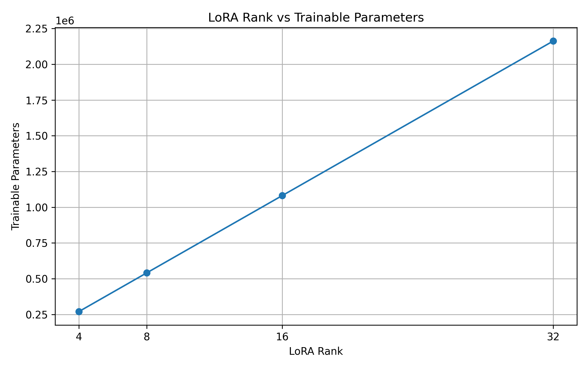
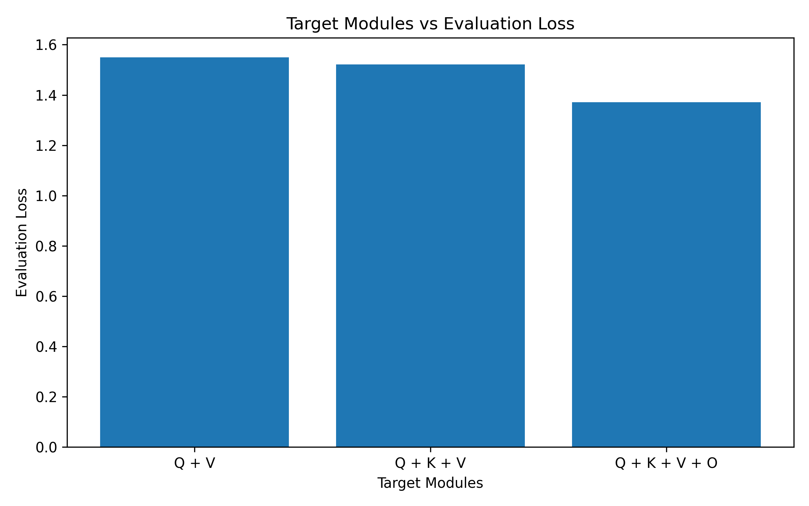
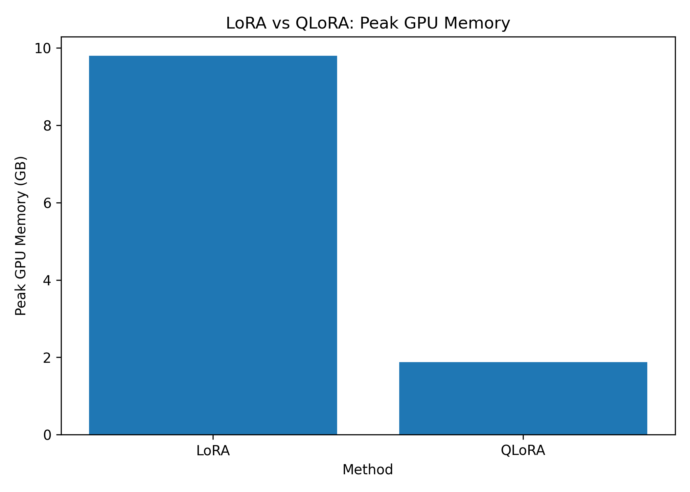

# Efficient Fine-Tuning of a Language Model using LoRA and QLoRA

This project is about fine-tuning Qwen2.5-0.5B-Instruct using LoRA and QLoRA. I experimented with different LoRA ranks and target modules, and compared their training behaviour, GPU memory usage, and results. I also included basic error analysis to understand where the model performed differently from the reference answers.
# Project Overview

- Full fine-tuning updates all the model parameters, which can require more GPU memory and storage.
- I used LoRA and QLoRA to see how much of the fine-tuning work could be done with a much smaller number of trainable parameters.
- The project includes experiments with different LoRA ranks and attention target modules.
- I also compared LoRA with QLoRA based on training behaviour, GPU memory usage, and loss.
- Finally, I evaluated the LoRA model and manually checked some of the low-scoring outputs to understand the actual errors.
# Objectives

- Fine-tune an instruction-following language model with LoRA.
- See how changing the LoRA rank affects the number of trainable parameters.
- Test different attention modules as LoRA targets.
- Compare LoRA and QLoRA in terms of training behaviour and GPU memory usage.
- Evaluate the generated responses using ROUGE scores and manual error analysis.
- Keep track of training time, loss, and GPU memory usage during the experiments.
# Model

**Model:** [`Qwen/Qwen2.5-0.5B-Instruct`](https://huggingface.co/Qwen/Qwen2.5-0.5B-Instruct)  
**Parameters:** ~0.5B  
**Architecture:** Decoder-only Transformer

I used the Instruct version because the project focuses on instruction-following tasks. It provides a suitable starting point for studying LoRA and QLoRA fine-tuning.
# Dataset

**Dataset:** [`yahma/alpaca-cleaned`](https://huggingface.co/datasets/yahma/alpaca-cleaned)

- Original examples: 51,760
- After removing exact duplicate examples: 51,756
- Training set: 41,404
- Validation set: 5,176
- Test set: 5,176
The dataset contains three main fields:

- `instruction`
- `input`
- `output`

The `instruction` describes the task, `input` provides additional information when needed, and `output` contains the expected response.
# Data Preparation

- Removed exact duplicate examples from the dataset.
- Combined `instruction` and `input` to create the user message. If no input was provided, only the instruction was used.
- Used the `output` field as the assistant response.
- Converted the data into the chat format expected by Qwen.
- Applied the Qwen chat template before tokenization.
- Tokenized the examples with a maximum sequence length of 512 tokens.
- Split the cleaned dataset into 80% training, 10% validation, and 10% test data using a fixed seed of 42.
## 7. Baseline Inference

Before fine-tuning, I tested the original Qwen2.5-0.5B-Instruct model on a simple instruction. This gave me a baseline response to compare with the model after LoRA fine-tuning.

**Example prompt:**

> Explain machine learning in simple words.
# LoRA Fine-Tuning

LoRA keeps the original model weights frozen and adds small trainable matrices to selected layers.

\[
W' = W + BA
\]

For the main LoRA experiment, I used the following setup:

| Parameter | Value |
|---|---:|
| Rank (`r`) | 16 |
| Alpha | 32 |
| Dropout | 0.05 |
| Target modules | `q_proj`, `v_proj` |
| Learning rate | 2e-4 |

The model had 495,114,112 total parameters, while only 1,081,344 parameters were trainable. This means that only 0.2184% of the parameters were updated during fine-tuning.
# LoRA Rank Ablation

I tested four LoRA ranks to see how the rank changes the number of trainable parameters. The other LoRA settings were kept consistent across the experiments.

| Rank | Trainable Parameters | Trainable % |
|---:|---:|---:|
| 4 | 270,336 | 0.0547% |
| 8 | 540,672 | 0.1093% |
| 16 | 1,081,344 | 0.2184% |
| 32 | 2,162,688 | 0.4359% |



As the rank increases, the number of trainable parameters also increases. This experiment was mainly used to observe parameter scaling with rank, rather than to decide which rank gives the best overall model performance.
## 10. Target Module Comparison

I kept the LoRA rank at 16 and tested different attention projections. The goal was to see how changing the target modules affected the trainable parameters and the training results.

| Target Modules | Trainable Parameters | Trainable % | Training Time (s) | Train Loss | Eval Loss |
|---|---:|---:|---:|---:|---:|
| Q + V | 1,081,344 | 0.2184% | 4.73 | 1.9778 | 1.5499 |
| Q + K + V | 1,474,560 | 0.2976% | 4.12 | 1.9523 | 1.5208 |
| Q + K + V + O | 2,162,688 | 0.4359% | 4.81 | 1.8334 | 1.3708 |



The number of trainable parameters increased as more attention projections were included. In this controlled experiment, the Q + K + V + O setup had the lowest evaluation loss among the three configurations.
# QLoRA Experiment

For the QLoRA experiment, the base model was loaded in 4-bit precision while the LoRA adapters remained trainable. I used NF4 quantization with FP16 as the compute dtype.

The same LoRA setup was used for a direct comparison with the main LoRA experiment:

- LoRA rank: 16
- Target modules: `q_proj`, `v_proj`
- LoRA alpha: 32
- LoRA dropout: 0.05
- Quantization: 4-bit NF4
- Compute dtype: FP16

| Metric | LoRA | QLoRA |
|---|---:|---:|
| Trainable Parameters | 1,081,344 | 1,081,344 |
| Training Time | 4.73 s | 12.30 s |
| Peak GPU Memory | 9.80 GB | 1.88 GB |
| Train Loss | 1.9778 | 2.0404 |
| Eval Loss | 1.5499 | 1.6260 |



The main difference observed in this controlled experiment was GPU memory usage. QLoRA used much less peak GPU memory, while the LoRA run completed faster in this particular test.
# LoRA Evaluation

The fine-tuned LoRA model was evaluated on 100 examples using ROUGE-based metrics. The generated responses were compared with their reference answers.

| Metric | Score |
|---|---:|
| ROUGE-1 | 0.3196 |
| ROUGE-2 | 0.1099 |
| ROUGE-L | 0.1975 |
| ROUGE-Lsum | 0.2646 |

The average generated response length was 101.92 words.

ROUGE was used as a text-overlap measure between the generated responses and the reference answers. Since the tasks include free-form responses, these scores were treated as an evaluation signal rather than a complete measure of correctness.
# Error Analysis

For the manual error analysis, 37 available evaluation examples were reviewed. These examples were sorted by ROUGE-L score, and the 10 lowest-scoring responses were inspected manually.

The responses were grouped into the following categories:

| Category | Count |
|---|---:|
| Valid variation | 6 |
| Incorrect | 1 |
| Partial | 1 |
| Incomplete | 1 |
| Instruction-following error | 1 |

The review showed that a low ROUGE score does not always mean that a response is incorrect. Some responses were valid but used different wording from the reference answer, especially for creative or rewriting tasks.
# Results Summary

- The main LoRA setup updated only 0.2184% of the model parameters.
- Increasing the LoRA rank from 4 to 32 increased the number of trainable parameters from 270,336 to 2,162,688.
- Changing the target modules affected both the number of trainable parameters and the recorded training and evaluation losses.
- In the controlled LoRA vs QLoRA experiment, peak GPU memory usage dropped from 9.80 GB to 1.88 GB with QLoRA.
- The manual error analysis showed that some low-ROUGE responses were valid variations rather than actual errors.
# Limitations

- Some experiments were run on controlled subsets instead of the complete training dataset.
- The LoRA vs QLoRA comparison was based on a short controlled experiment, so the results should not be treated as a general performance comparison.
- ROUGE mainly measures text overlap and cannot fully capture the meaning or correctness of a generated response.
- The manual error analysis focused on the 10 lowest-ROUGE examples from the available evaluation data rather than reviewing every generated response.
- The training and memory measurements were collected in a Colab T4 environment, so they may differ on other hardware.
# Project Structure

```text
efficient-finetuning-lora/
│
├── lora_finetuning.ipynb
├── requirements.txt
│
├── results/
│   ├── rank_ablation_results.csv
│   ├── target_module_results.csv
│   ├── lora_vs_qlora_results.csv
│   ├── error_analysis_results.csv
│   ├── experiment_results.json
│   ├── rank_vs_trainable_params.png
│   ├── target_modules_vs_eval_loss.png
│   └── lora_vs_qlora_memory.png
│
└── README.md
````

# Technologies Used

- Python
- PyTorch
- Hugging Face Transformers
- Hugging Face Datasets
- PEFT
- bitsandbytes
- Pandas
- ROUGE
- Google Colab
# How to Run

Clone the repository and install the required packages:

```bash
git clone https://github.com/kartik2006-del/efficient-finetuning-lora.git
cd efficient-finetuning-lora
pip install -r requirements.txt
```
# Conclusion

This project helped me compare different approaches to fine-tuning a language model with a focus on reducing the number of trainable parameters. LoRA allowed fine-tuning with only 0.2184% of the model parameters, while the controlled QLoRA experiment showed a large reduction in peak GPU memory usage.
# Author

**Kartik Kumar**

- GitHub: [kartik2006-del](https://github.com/kartik2006-del)
